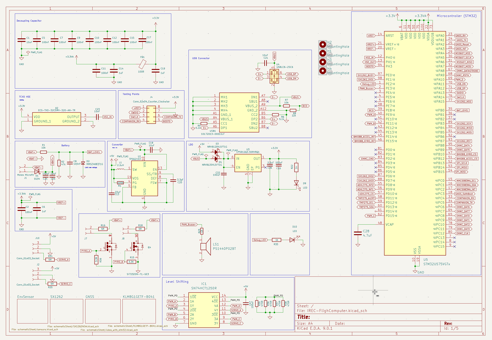

# Flight Computer VersionA1.1

## Changes
- new layout
- added debug LED
- resized pcb
- extended gps ground plane area
- fixed schematic
## Specifications
**Dimension:** 10.9 x 59 mm
**Ports:** 2 pyro, 2 Servo ports , 1 USB-C
**Layer counts:** 4 layers

